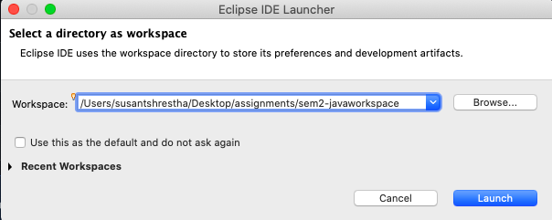

# SEM-2 JAVA ASSIGNMENTS

This is the repository to push all of the java assignment.

## Setting up the repository

- Clone the repo

```
    git clone git@github.com:susantlalshrestha/sem2-javaworkspace.git
```

- Open the workspace

  

- Import the project to workspace

  

- Go to the terminal run the following command one by one (make sure your present working directory is sem2-javaworkspace in the terminal)

```
    git status
    git config -g user.name YOUR_GITHUB_USERNAME
    git config -g user.email YOUR_GITHUB_EMAIL
```

## Some git commands

- Creating new branch

```
    git branch BRANCH_NAME
```

- Going to another branch

```
    git checkout BRANCH_NAME
```

- Creating a new branch and going to that branch

```
    git checkout -b BRANCH_NAME
```

- Stage the changes

```
    git add .
```

- Commit the changes

```
    git commit -m "COMMIT MESSAGE"
```

- Push the branch to the origin (remote)

```
    git push -u origin BRANCH_NAME
```
